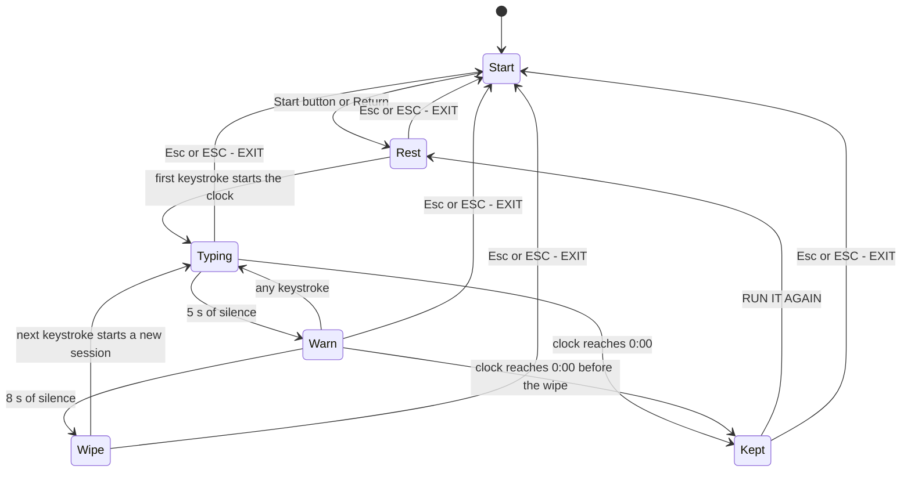
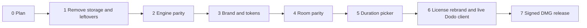

# writeitdown for macOS - Build Plan

Status: batches 0 and 1 accepted; batch 2 follows. Written 2026-09-24. The inventory and native-source comparisons below record the pre-batch-1 baseline; the last column assigns each change to its batch.

This plan turns the existing native app in `apps/macos/FirstLine/` into the writeitdown macOS app. It is the governing document for every later batch. Each batch lands as one pull request through no-mistakes, merges only when its acceptance is green, and is then accepted again by a fresh session against this document.

## 1. Goal

- The app is a native AppKit writing room that behaves like the live site at https://writeitdown.app: forward-only writing, a warning after five seconds of silence, the draft wiped after eight seconds of silence, and a kept draft that the writer can copy out when the clock runs out.
- The one new capability is a duration picker before writing starts, modeled on The Most Dangerous Writing App. The default stays at one minute, the same as the web.
- The app does only the writeitdown thing. First Line and Zero Draft leftovers that do not serve that job (the draft Library, saved Markdown files, Copy for AI, fossils, the separate Failure screen) are removed.
- The paid license flow stays. It is rebranded to writeitdown and reuses the design in `apps/macos/FirstLine/docs/LICENSE_PAYMENT_SPEC.md`.
- Writing never leaves the machine and is never written to disk.

The existing app is already pure AppKit: every source file under `apps/macos/FirstLine/Sources/FirstLine/` imports AppKit or Foundation, and none imports SwiftUI. The work adapts this code. It is not a rewrite from zero.

## 2. Evidence

### 2.1 Baseline of the existing app

- On 2026-09-24, from `apps/macos/FirstLine/`, `swift build` exited 0 and `swift test` exited 0 with 100 tests in 8 suites.
- The tests use Swift Testing (`@Test` functions inside `struct` suites), not XCTest classes. Every test named in this plan is a Swift Testing function and can be run alone with `swift test --filter <Suite>/<function>`.

### 2.2 The live writeitdown.app site

Observed on 2026-09-24 with a Playwright script against https://writeitdown.app in headless Chrome at 1440x900, light appearance. The full log is `/Users/ichts/firstmate-homes/first-line/data/zd-wid-mac-plan/wid-live-2026-09-24.log` and the screenshots are `/Users/ichts/firstmate-homes/first-line/data/zd-wid-mac-plan/shots/wid-*.png`. The live behavior matched the source in `writeitdown/`.

- The CTA `Give it sixty seconds.` opens the `#trial` room and focuses the editor. The placeholder reads `Start typing.` and the clock reads `1:00`.
- The clock does not start on entry. After two idle seconds it still read `1:00`; it started on the first keystroke (`writeitdown/session.mjs`, `append`).
- Backspace, Delete, ArrowLeft, ArrowUp, Home, Cmd+Z, Cmd+X, and Cmd+V all left the text unchanged, kept the caret at the end, and announced `BLOCKED. FORWARD ONLY.` in the live region. Cmd+A moved the selection, but the next typed characters still appended at the end.
- Each blocked key ran two 280 ms animations on the paper: a horizontal shake of at most 2 px and a 1 px outline in the `--alarm` color (`writeitdown/feedback.js`). A repeated block does not restart a running shake. A 110 Hz tone plays only after a prior user gesture.
- After 5.3 s of silence the phase was `warn`, the numeral read `3`, and the line `KEEP TYPING OR THE DRAFT IS DELETED.` appeared (screenshot `wid-07-warn.png`). One keystroke returned the phase to `typing` and kept the text.
- After 8.3 s of silence the editor was empty and the report read `DRAFT WIPED - 0:45 UNUSED. TYPE TO RESTART.` The room stayed open and the next keystroke started a fresh minute.
- A full real-time minute with a keystroke every two seconds ended in the kept state: `You wrote it down.`, the full text, the receipt `0:00 - 30 WORDS KEPT.`, focus on `COPY TEXT`, and a `RUN IT AGAIN` link (screenshot `wid-09-kept.png`). Clicking COPY TEXT put the exact draft on the clipboard and the button read `COPIED`.
- Escape left the room, cleared the hash, and returned focus to the CTA.
- Every request was a GET to `writeitdown.app`, `fonts.googleapis.com`, or `fonts.gstatic.com`. No writing was sent anywhere.

### 2.3 The Most Dangerous Writing App (reference for the picker)

Observed on 2026-09-24 at https://www.squibler.io/dangerous-writing-prompt-app, the official URL named by Squibler (which acquired the app in 2019) and by the app's Wikipedia entry. The legacy domain `themostdangerouswritingapp.com` failed with a certificate error on that date. Screenshots are in `/Users/ichts/firstmate-homes/first-line/data/zd-wid-mac-plan/shots/`:

- `mdwa-squibler-02-picker-open.png` shows the open picker.
- `mdwa-squibler-03-words.png` shows the Words tab.
- `mdwa-squibler-06-timed-writing.png` shows the writing screen.
- `mdwa-squibler-05-success.png` shows the success screen.
- `mdwa-squibler-08-failed.png` shows the failure screen.

What the reference does:

- The start screen shows `Session length: 5 minutes` as a small inline control next to the two start buttons (`Generate a prompt` and `Start writing without a prompt`). Clicking it opens a small popover.
- The popover has two tabs, `Minutes / Words`. Minutes offers 3, 5, 10, 15, 20, 30, and 60, with 5 selected by default. Words offers 150, 250, 500, 750, and 1667, with 250 selected by default. A `Hardcore mode` checkbox hides the text and disables backspace. A close button dismisses the popover.
- The choices are plain `span` elements. Tab moves focus to the close button, not to the numbers, so the choices are not reachable from the keyboard.
- The writing screen is a blank page with a word count at the bottom and a thin progress bar along the top edge. It shows no numeric clock. Outside Hardcore mode, backspace works.
- After about five seconds of silence the screen turns red with `You failed...` and a `Try again!` button, and the draft is gone.
- On success the progress bar turns green, the full text stays on screen, and the page offers `Download N words` and `Start Again`.

What this plan borrows: a small, fixed set of durations chosen on the start screen before writing, visible but out of the way, with the choice remembered. What it does not borrow: word-count goals, Hardcore mode (writeitdown is already stricter, because nothing can be deleted), prompts, the red failure screen, and the missing keyboard access.

## 3. Product rules: web to native

The web column cites the file that owns each rule today. The native column records the pre-batch-1 implementation in `apps/macos/FirstLine/Sources/FirstLine/` (shortened to `Sources/` below). The last column assigns each change to its batch.

| # | Rule | Web source | Native baseline (batch 0) | Change |
|---|---|---|---|---|
| 1 | The clock starts on the first input, not on entry. | `writeitdown/session.mjs` (`append`) | `Sources/Session/SessionEngine.swift` starts the clock in `start(duration:)`. An untouched draft is exempt from danger. | Batch 2 starts the clock on the first committed or marked text. |
| 2 | Only appending is allowed. Deletion, cut, paste, drop, undo, redo, arrow keys, Home, and Page Up or Down are blocked. IME composition still works. | `writeitdown/room.js` (`beforeinput`, `keydown`, paste/cut/drop listeners) | `Sources/Editor/AppendOnlyInputPolicy.swift` and `Sources/Editor/AppendOnlyTextView.swift`. Arrow and Home moves are caught by the selection redirect in `Sources/Session/SessionViewController.swift`. | Keep. Batch 2 adds explicit tests for the movement commands. |
| 3 | A blocked action shakes the paper by 2 px, shows a 1 px alarm outline for 280 ms, announces `BLOCKED. FORWARD ONLY.`, and does not restart while running. Reduced motion keeps the outline and drops the shake. | `writeitdown/feedback.js`, `writeitdown/room.js` (`deny`) | `Sources/Session/SessionViewController.swift` (`triggerDenyFeedback`): a 90 ms red hairline, a 160 ms shake, and the narrator line `NO GOING BACK.` | Batch 4 matches the web timing, color, announcement, and no-restart rule. |
| 4 | After 5 s of silence the wash ramps in, and the numeral counts 3, 2, 1 in the alarm color over `KEEP TYPING OR THE DRAFT IS DELETED.` | `writeitdown/room.js` (`render`), `writeitdown/site.css` | `Sources/Session/SessionEngine.swift` (`dangerAfterSeconds = 5`), with the veil and countdown in `SessionViewController.swift`. | Keep the rule. Batch 4 restyles the wash and numeral with site tokens. |
| 5 | After 8 s of silence the draft is wiped. The room stays open with `DRAFT WIPED - M:SS UNUSED. TYPE TO RESTART.` and the next keystroke starts a new session. | `writeitdown/session.mjs` (`advance`), `writeitdown/room.js` | `SessionEngine.swift` (`wipeAfterSeconds = 8`) routes to a separate screen in `Sources/Session/FailureViewController.swift` with fossils. | Batch 2 captures unused time and provides a minimal in-room wipe/restart route. Batch 4 removes the obsolete Failure screen and polishes the report. |
| 6 | The earlier deadline wins, and a tie goes to the wipe. | `writeitdown/session.mjs` | `SessionEngine.swift` (`adjudicateDeadlines`) | Keep. |
| 7 | A whitespace-only draft at the deadline is wiped, not kept. | `writeitdown/session.mjs` (`!state.text.trim()`) | `SessionEngine.swift` ends an empty draft as idle and keeps a whitespace-only draft. | Batch 2 adopts the web rule. |
| 8 | When the clock runs out, the draft is kept: `You wrote it down.`, the full text, `0:00 - N WORDS KEPT.`, `COPY TEXT` (then `COPIED`), and `RUN IT AGAIN`. Focus goes to COPY TEXT. | `writeitdown/index.html` (`#kept`), `writeitdown/room.js` | Before batch 1, `Sources/Session/SuccessViewController.swift` offered Copy full text, Copy for AI, Download .md, and Discard, and `Sources/App/AppState.swift` autosaved the draft to disk. | Batch 1 removed autosave, Copy for AI, and Download. Batch 4 matches the web copy and layout. |
| 9 | The count is Unicode words, and each Han character counts as one. Punctuation and emoji do not count. | `writeitdown/session.mjs` (`wordCount`) | `SessionEngine.swift` (`wordCount`) splits on whitespace only. | Batch 2 ports the web rule. |
| 10 | ESC and the `ESC - EXIT` control leave the room right away. Nothing is saved. | `writeitdown/room.js` (`exit`) | `SessionViewController.swift` has the `Abandon - the text is lost` button. `Cmd+0` goes Home. | Batch 4 adds `ESC - EXIT` at the bottom left and handles Escape outside IME composition. |
| 11 | There is no early finish. A session ends only at the deadline or by exiting. | `writeitdown/room.js` | `SessionViewController.swift` has a `Finish` button and Cmd+Return. `SessionEngine.swift` has `finish()`. | Batch 2 removes the engine method, button, Cmd+Return paths, and tests together. |
| 12 | The clock shows `M:SS` at the top right, and the count shows `N WORDS` at the bottom right. | `writeitdown/index.html`, `writeitdown/site.css` | `SessionViewController.swift` shows `MM:SS`, a progress bar, and lowercase `N words`. | Batch 4. |
| 13 | Appearance follows the system by default and can be switched between light and dark. | `writeitdown/theme.js`, `writeitdown/site.css` | `Sources/Infrastructure/SettingsStore.swift` (`AppTheme`), `Sources/DesignSystem/Colors.swift` (the Zero Draft bone palette with red `#c8392f`). | Batch 3 ports the site tokens for both appearances. |
| 14 | No draft is stored. Only the appearance preference persists. | `writeitdown/theme.js` (`writeitdown-theme` is the only key) | Before batch 1, `Sources/Infrastructure/PersistenceService.swift` wrote kept drafts as Markdown and `Sources/Library/LibraryViewController.swift` browsed them. | Batch 1 deleted both. Settings keep only preferences and the license cache (section 7). |
| 15 | The writing view shows the active line in a centered band with two fading lines above it and no scrollbar. | `writeitdown/site.css` (`#editor` mask), `writeitdown/room.js` (`fitEditor`) | `AppendOnlyTextView.swift` (zen typography, caret anchored at 35% of the height). | Batch 4 recenters the band to match the site. The zen typography stays. |
| 16 | The session length is chosen before writing. | Fixed at 60 s on the web | Fixed at 60 s. `AppState.selectedDuration` and `AppSettings.defaultDuration` already exist but are pinned to 60. | Batch 5 adds the picker. |

The session flow after batch 5, using the web's phase names:



`Start` is the start screen with the duration picker. It replaces the Home screen in `Sources/App/HomeViewController.swift`.

## 4. Duration picker

### 4.1 Options and default

- The options are 1, 3, 5, 10, 15, 20, 30, and 60 minutes. This is the reference's minute set plus the web's one minute.
- The default on first launch is 1 minute.
- The last choice is remembered in `settings.json` through the existing `AppSettings.defaultDuration`. It is a preference, not writing.
- Word-count goals and Hardcore mode are out of scope. Word goals change what "done" means and conflict with the wipe report's unused-time line. Hardcore mode would only hide the text, because writeitdown already blocks deletion.

### 4.2 Placement and interaction

- The start screen keeps the web landing's hierarchy: the `WRITE_IT_DOWN` logotype, the headline `We force you to write it down.`, the deck line, and one primary button.
- The picker sits directly above the primary button as one row labeled `SESSION` in the mono chrome style, followed by the choices `1 3 5 10 15 20 30 60` and the unit `MIN`. The selected choice is drawn in ink with a 1 px underline. The others use the muted color.
- The primary button names the chosen length the way the web names sixty seconds: `Give it sixty seconds.` for 1, `Give it three minutes.` for 3, and so on up to `Give it sixty minutes.` for 60.
- The control is an `NSSegmentedControl` in single-selection mode, drawn with the site tokens. HIG recommends a segmented control for a small set of mutually exclusive choices, and it brings VoiceOver support for free. Each segment's accessibility label is the full phrase, such as "3 minutes".
- The picker exists only on the start screen. It cannot be changed during a session. The room's clock shows the chosen length before the first keystroke, for example `5:00`.
- After a wipe, typing restarts with the same length. After a kept session, `RUN IT AGAIN` uses the same length. The writer returns to the start screen with Esc to change it.

### 4.3 Keyboard access

- On the start screen the picker is the first key view and the primary button is the default button, so Return starts a session.
- Left Arrow and Right Arrow move the selection inside the focused picker when Full Keyboard Access is enabled. Tab moves to the button. The menu below is the always-available keyboard path, without requiring that system setting.
- A `Session` menu in the menu bar lists the eight lengths as items with a checkmark on the current one. It also lists `Start Writing` (Cmd+N) and `Exit Room` (Esc as a displayed shortcut). The duration items are disabled while a session is live. This follows the HIG rule that every command is reachable from the menu bar.
- Cmd+1 through Cmd+8 select the eight lengths from the start screen. The existing `Cmd+1` Writing and `Cmd+0` Home items in `Sources/App/MainMenuBuilder.swift` are replaced, because there is no longer a Library or a separate Home to navigate between.

### 4.4 Silence thresholds: recommendation

Recommendation: keep 5 s to warn and 8 s to wipe for every duration. Do not scale them, and do not expose them as a setting.

- The fixed silence rule is the product. The site promises "stop for eight seconds and your draft is deleted" without qualification, and the app must not quietly weaken it for longer sessions.
- The reference app uses one fixed silence limit of about five seconds for every length from 3 to 60 minutes, and its users treat that as the challenge.
- A scaled rule would make the warning numeral's 3, 2, 1 inconsistent, complicate every piece of copy, and give a reason to pick longer sessions just to get a softer threat.
- Longer sessions are already harder because the threat lasts longer. That is the point of choosing one.
- The engine keeps the thresholds as named constants (`SessionEngine.dangerAfterSeconds`, `SessionEngine.wipeAfterSeconds`). If the captain later wants scaling, it is a one-place change with tests, not a new setting.

### 4.5 Governance note

`VISION.md` says "一场会话六十秒" and treats the numbers as a contract. The captain's request for a duration picker changes that for the writeitdown app. Batch 5 updates the matching line in `VISION.md` to say that the writer picks a length before the first keystroke, the default is sixty seconds, and 5 s and 8 s stay fixed. The pull request cites the captain's request as the authority. If the reviewer or no-mistakes asks, it is escalated as an ask-user finding and not decided by the worker.

## 5. Inventory

Paths are relative to `apps/macos/FirstLine/`.

### 5.1 Delete

| Path | Why | Batch |
|---|---|---|
| `Sources/FirstLine/Library/LibraryViewController.swift` | The app keeps no drafts. | 1 |
| `Sources/FirstLine/Infrastructure/PersistenceService.swift` | It writes kept drafts to disk. | 1 |
| `Tests/FirstLineTests/LibraryPersistenceTests.swift` | It tests the deleted Library. | 1 |
| `Tests/FirstLineTests/PersistenceOnlyTests.swift` | It tests the deleted draft storage. | 1 |
| `Sources/FirstLine/Session/SuccessText.swift` | It holds Copy for AI and Markdown export, which the web does not have. `VISION.md` also says there is no AI. | 1 |
| `Tests/FirstLineTests/SuccessSurfaceTests.swift` | It tests `SuccessText`. It is replaced by `KeptSurfaceTests`. | 1 |
| `Sources/FirstLine/Session/FailureViewController.swift` | The wipe report moves into the room. | 4 |
| `Sources/FirstLine/DesignSystem/FossilLayerView.swift` | The site has no fossils. | 4 |

The following code inside kept files is also deleted:

- In `Sources/FirstLine/App/AppState.swift`: batch 1 removes the library state, save retries, Library and delete actions, `revealLibraryFolder`, `.library`, and `updateImmersiveMode`. Batch 4 removes the in-memory `lastWipeFossil` aftermath and `.failure` surface. Batch 6 rebrands `openLaunchWebsite` and license help; neither license nor checkout entry points are removed in batch 1.
- In `Sources/FirstLine/Infrastructure/AppPaths.swift`: `libraryDirectory` and `recoveryDirectory`.
- In `Sources/FirstLine/Infrastructure/SettingsStore.swift`: `immersiveSessionMode` and the writable `hasUnlockedFullAccess` mirror. Preserve read-only decoding of the legacy key so an existing unlocked configuration migrates to `licenseStatus = .active`; activation and revocation update only `licenseStatus`. This guarantee applies to the old configuration directory; batch 3's new brand directory does not import it.
- In `Sources/FirstLine/Session/SessionEngine.swift`: `finish()`.
- In `Sources/FirstLine/Session/SessionViewController.swift`: the fossils, the narrator strip, the Finish button, the Cmd+Return monitor, the progress bar, and the Abandon button.
- In `Sources/FirstLine/App/HomeViewController.swift`: the wipe aftermath line and fossil.
- In `Sources/FirstLine/Settings/SettingsViewController.swift`: the Storage section.
- In `Sources/FirstLine/App/MainMenuBuilder.swift`: the Library item.
- In `Tests/FirstLineTests/SmokeFlowTests.swift`: the tests that cover autosave, the Library, and save retries. Batch 2 removes `finish` tests, and batch 4 removes wipe aftermath tests. Batch 1 removes `happyPathAutoSavesOnSuccess`, `manualFinishAutoSavesExactlyOnce`, `failedSaveRetriesWithSnapshotEvenAfterNewSessionStarts`, `concurrentFailingSavesEachGetTheirOwnRetry`, `failureCapturesAftermathVisibleAfterGoingHome`, `startingASessionClearsTheWipeAftermath`, `wipedDraftIsExposedForTheJoinedFossil`, `legacyPersistedDurationIsSupersededByFixedSixtySeconds`. Keep the license migration tests and update their assertions for the read-only legacy key. The two save-retry tests are the wall-clock tests that `docs/MANUAL_QA.md` records as flaky under load, so this also removes that flake.

### 5.2 Keep and adapt

| Path | Keep because | Adaptation |
|---|---|---|
| `Sources/FirstLine/Session/SessionEngine.swift` | It owns the monotonic, sleep-aware deadline adjudication. | First-input start, whitespace wipe, unused seconds, web word count, and a validated duration (batch 2). |
| `Sources/FirstLine/Editor/AppendOnlyInputPolicy.swift` | It is the single tested source of the forward-only guards. | No behavior change. Tests are added for movement commands (batch 2). |
| `Sources/FirstLine/Editor/AppendOnlyTextView.swift` | It holds the IME-safe append-only editor, UTF-16 caret handling, and zen typography. | Site typography and the centered band (batch 4). |
| `Sources/FirstLine/Session/SessionViewController.swift` | It is the room. | It hosts the rest, typing, warn, wipe, and kept states in one view (batch 4). |
| `Sources/FirstLine/Session/SuccessViewController.swift` | It is the kept surface. | It becomes the kept view inside the room, or is folded into `SessionViewController` if that is simpler (batch 4). |
| `Sources/FirstLine/App/HomeViewController.swift` | It is the start screen. | Brand copy (batch 3). Picker (batch 5). |
| `Sources/FirstLine/App/AppState.swift` | It owns navigation and the trial gate. | Removals (batch 1). Trial consumed on the first keystroke (batch 6). |
| `Sources/FirstLine/App/FirstLineMain.swift`, `RootWindowController.swift`, `RootContainerViewController.swift`, `MainMenuBuilder.swift` | They are the AppKit shell. | Names, title, and menus (batches 3 and 5). |
| `Sources/FirstLine/Licensing/LicenseClient.swift`, `LicenseModels.swift`, `MockLicenseClient.swift` | The paid license flow stays. | Add a live Dodo client (batch 6). |
| `Sources/FirstLine/Infrastructure/InstallIDStore.swift` | It provides the Dodo activation instance name without hardware IDs. | Rename the root folder (batch 3). |
| `Sources/FirstLine/Upgrade/UpgradeViewController.swift` | It is the trial-exhausted purchase screen. | Brand copy and a real checkout link (batch 6). |
| `Sources/FirstLine/Settings/SettingsViewController.swift` | It holds appearance, motion, and the license. | Remove Storage (batch 1). Brand (batch 3). The duration row becomes read-only text that points to the picker (batch 5). |
| `Sources/FirstLine/DesignSystem/Colors.swift`, `Typography.swift`, `Spacing.swift`, `FirstLineButtons.swift`, `FloodCanvasView.swift`, `WritingFontCandidate.swift` | They are the design token layer and bundled fonts. | Site tokens (batch 3). |
| `Sources/FirstLine/Resources/` | It holds Newsreader, IBM Plex Mono, and Zhuque Fangsong, with their OFL texts. | Keep all three. The site uses the first two, and Zhuque covers CJK. |
| `Tests/FirstLineTests/SessionEngineTests.swift`, `EditorFocusTests.swift`, `SettingsStoreTests.swift`, `LicenseFlowTests.swift`, `SmokeFlowTests.swift` | They cover the rules that stay. | Update per batch. |

## 6. Brand and visuals

- The app name in Finder and the menu bar is `Write It Down`. The in-app logotype is `WRITE_IT_DOWN`, matching the site. The window title is `Write It Down`.
- The bundle identifier is `app.writeitdown.mac`. The Swift package product and executable target are renamed from `FirstLine` to `WriteItDown` in batch 3. The directory `apps/macos/FirstLine/` keeps its path; the app name and distribution do not depend on the source directory name.
- `AppPaths` changes its folder from `~/Library/Application Support/First Line/` to `~/Library/Application Support/WriteItDown/`. Nothing is migrated. The old folder held drafts, which the new app must not read, and license data from a mock client that never sold a key.
- Colors come from `writeitdown/site.css` for both appearances:
  - Light: wall `#d8d2c3`, paper `#f7f4ea`, ink `#1a1813`, mute `#6f6a5d`, faint `#b3ada0`, and alarm `#8f4405`. The wash is `#d1c1ac` on the wall and `#ebdfce` on the paper, and the deeper cut is `#c6b095` and `#decab3`.
  - Dark: wall `#15140f`, paper `#211f18`, ink `#ece7d9`, mute `#8f897a`, faint `#5c574c`, and alarm `#f2a93b`. The wash is `#2e1712` and `#3a1c15`, and the cut is `#3d1d15` and `#4a2318`.
  - The Zero Draft red `#c8392f` and the bone canvas are removed. The alarm color is spent only on the warning numeral and the deny outline.
- Light is the design and QA reference, and every QA record captures light first. Dark is supported and captured once per batch that changes visuals. The default follows the system appearance, the same as the site and as HIG expects. Settings offers System, Light, and Dark.
- Typography follows the site: Newsreader for the human layer (the headline, the writing, and the kept text) and IBM Plex Mono for the machine layer (the clock, counts, reports, and buttons), with tracked uppercase mono for chrome. The paper has square corners and one soft lift shadow.
- The icon is new: the `WRITE_IT_DOWN` mark or a cursor on paper in the light tokens. It is exported into `Sources/FirstLine/Assets.xcassets/AppIcon.appiconset/` in batch 3 and compiled to `.icns` by the batch 7 packaging script. The final artwork is a captain review item and does not block batch 3, which can ship a placeholder built from the site's logotype.
- HIG: the app uses the standard menu bar, a resizable window with a sensible minimum size, `Cmd+,` for Settings, full keyboard access, VoiceOver announcements for deny, warn, wipe, and kept, and respects Reduce Motion and Increase Contrast.

## 7. Privacy

- Writing stays in memory. It is never written to disk, never logged, and never sent anywhere. Batch 1 isolates both the configuration root and the former draft root in temporary directories for kept and wiped sessions, and observes that no draft text or draft file appears in either. Tests also check that these flows do not write to the real user root. Configuration and install ID persistence remain legitimate and are tested separately; an empty directory is not the criterion.
- `settings.json` holds only the appearance, the reduced-motion override, the chosen duration, the trial count, and the license cache (key, status, dates, and instance ID), as the license spec allows. `install-id.json` holds a random install UUID.
- The only network traffic is the license flow: Dodo's public `activate` and `validate` license endpoints, called with the license key and install name only, plus opening the checkout page in the default browser. No analytics, no crash reporting, and no update checks are added.
- The fonts are bundled, so the app makes no font requests, unlike the site.
- The in-app About text and the site's privacy page state this in one sentence each. The site change ships with batch 7 as part of a normal writeitdown bundle install.

## 8. Distribution and pricing (decided)

The captain decided on 2026-09-24: "可以是签名的 DMG 直接下载 要收费的", and then set the price: "4.99".

- Distribution is a Developer ID signed, hardened-runtime, notarized, stapled DMG downloaded from writeitdown.app. There is no Mac App Store build. This matches the existing `docs/RELEASE_CHECKLIST.md`.
- The app is paid with a one-time purchase through Dodo Payments. It reuses `docs/LICENSE_PAYMENT_SPEC.md`: a hosted checkout, a license key by email, 2 Macs per license, a 14-day refund, a 3-session Mac trial, and a 7-day offline grace period, all rebranded to writeitdown.
- The price is USD $4.99, paid once. Every piece of copy that names a price reads `$4.99`.
- The price is configuration, not code. The app reads the display price (`$4.99`) and the checkout URL from two `Info.plist` keys, `WIDDisplayPrice` and `WIDCheckoutURL`, through one accessor in `AppState`. Swift sources and tests never contain the literal price. The charged amount lives in the Dodo product, and the site's Mac section shows the same `$4.99`. A later price change edits the Dodo product, the two copies of the display string, and nothing else.
- One trial session is counted when its first keystroke lands, not when the room opens. That matches the web's start rule and means an untouched room never costs a trial.

### 8.1 Owner-account steps (needed at the release batch)

These are the captain's account actions. They are needed at batch 7 and do not block batches 1 to 6.

- [ ] Enroll or confirm the Apple Developer Program membership.
- [ ] Create a Developer ID Application certificate and install it with its private key in the release Mac's keychain.
- [ ] Create notarization credentials: an app-specific password or an App Store Connect API key, stored with `xcrun notarytool store-credentials` under a profile name the release script reads.
- [ ] Create the Dodo one-time product for writeitdown with license keys enabled, an activation limit of 2, and a one-time price of USD $4.99.
- [ ] Provide the Dodo checkout URL and the live-mode product ID.
- [ ] Confirm the support email and the copyright holder name (both open in the license spec).
- [ ] Approve the final app icon.
- [ ] Approve the site copy for the Mac section in `writeitdown/support.html` and install the updated site bundle.

## 9. Batches

Every batch follows the same flow:

- It is branched from the latest `main` that includes the previous accepted batch.
- It runs through no-mistakes to a pull request with green checks.
- It merges only after its acceptance commands pass.
- A fresh session then accepts it (section 10) before the next batch starts.

Every batch updates the L3 headers of the Swift files it touches, `apps/macos/FirstLine/AGENTS.md`, and `apps/macos/AGENTS.md` when members or boundaries change, as the repository's GEB protocol requires.



Every batch uses this common acceptance set, run from `apps/macos/FirstLine/`:

```bash
swift build            # must exit 0
swift test             # must exit 0; the record states the test count
scripts/qa-window.sh <batch> # real-window QA; screenshots under /tmp/wid-qa/<batch>/
```

Batch 1 creates `scripts/qa-window.sh`. It builds the debug binary, launches it, drives it with `osascript` (System Events key codes, one key at a time, because long `keystroke` strings drop spaces), captures the app window only with `screencapture -l <window id>`, and quits the app. Each batch extends the script with its own states. A person or agent then inspects every screenshot and appends a dated record to `docs/MANUAL_QA.md` listing each state, its screenshot path, and pass or fail. States that synthetic events cannot prove, such as physical IME candidate windows and the exact 280 ms feedback frame, are listed as not verified instead of being claimed.

### Batch 1: Remove storage and leftovers

- Scope: delete the files in section 5.1 marked batch 1, along with autosave, save retries, the Library menu item and surface, the Storage settings section, Copy for AI, and Download .md. Preserve license data, the legacy unlocked-key read-only migration, and activation/revocation without the writable mirror. The kept screen temporarily keeps only `Copy full text` and `Discard` until batch 4 restyles it; this is not yet web parity. Add `scripts/qa-window.sh`.
- Named tests:
  - `SmokeFlowTests/keptSessionWritesNoFiles`: a kept session with isolated configuration and draft roots leaves no writing on disk and causes no real-root write.
  - `SmokeFlowTests/wipedSessionWritesNoFiles`: the same isolation and no-writing assertion after a wipe.
  - `SmokeFlowTests/libraryIsNotANavigationTarget`: the menu and observable navigation do not expose a Library.
  - `SettingsStoreTests/settingsIgnoreRemovedStorageFields`: old storage preferences decode, while `hasUnlockedFullAccess` still upgrades an old unlocked license to active.
- Checks: `! rg -n 'PersistenceService|LibraryViewController|copyForAI|exportMarkdown|libraryDirectory|recoveryDirectory|Surface\.library|openLibrary|LibrarySession|revealLibraryFolder|lastPersistedSessionID|saveRetryTasks|Copy for AI|Download \.md|SuccessText' Sources Tests` exits 0. Check remaining write paths for draft content, while allowing isolated `settings.json` and `install-id.json`. These tests and the QA script are created in this batch, not pre-existing.
- Window QA: the start screen, a typed session, Cmd+2 doing nothing, Settings without Storage, and the kept screen with two actions.
- Done when the common set is green, the checks print nothing, and the QA record is appended.

### Batch 2: Engine parity

- Scope: in `SessionEngine`:
  - The clock starts on the first committed or marked text. `start(duration:)` only readies the room.
  - A whitespace-only draft at the deadline wipes.
  - The engine captures `unusedSeconds = ceil((finishDeadline - wipeDeadline) / 1 second)` from absolute deadlines before clearing text, as `writeitdown/session.mjs` does. It clears that report when the next input starts a fresh session. A delayed tick must not change the number.
  - The web word count is ported: Unicode word segments, each Han character counted alone, punctuation and emoji not counted. Use `NSString.enumerateSubstrings(in:options: .byWords)` after splitting Han characters out, or an equivalent.
  - Remove `finish()` and every UI entry point that invokes it: Finish button, Cmd+Return monitor, `performKeyEquivalent`, and their early-finish tests. This is a minimum functional removal; visual room cleanup stays in batch 4.
  - Implement the minimum in-room wipe report and next-keystroke restart routing in `RootWindowController` and `SessionViewController` in this batch. Leave detailed layout and animation for batch 4; the intermediate state must be usable.
  - Validate durations identically in every build: unsupported or unreadable stored values fall back to 60 seconds. Never use a debug-only precondition or a release-only clamp.
  - After a wipe, the next keystroke starts a new session with the same duration through `AppState.startSession`, so an exhausted trial routes to Upgrade rather than restarting. Batch 6 changes when a trial use is consumed, not this gate.
- Named tests:
  - `SessionEngineTests/clockStartsOnFirstInputNotOnStart`.
  - `SessionEngineTests/markedTextStartsTheClock`.
  - `SessionEngineTests/whitespaceOnlyDraftAtDeadlineWipes`.
  - `SessionEngineTests/wipeReportsUnusedSeconds`, including late ticks, deadline ties, and changed durations.
  - `SessionEngineTests/keystrokeAfterWipeStartsFreshSessionWithSameDuration`.
  - `SessionEngineTests/wordCountMatchesWebCases`, which ports every case in `writeitdown/session.test.mjs`.
  - `SessionEngineTests/fiveAndEightSecondRulesHoldForSixtyMinuteSession`.
  - `SettingsStoreTests/invalidStoredDurationFallsBackToSixtySeconds`.
  - `EditorFocusTests/movementCommandsDenyAndKeepCaretAtEnd`, which covers `moveLeft:`, `moveUp:`, `moveToBeginningOfDocument:`, `pageUp:`, and `moveWordLeft:`.
  - The existing deadline tests are kept and updated: `exactDeadlineTieResolvesToFailure`, `bothDeadlinesPassedWithSilenceEarlierResolvesToFailure`, and `lateActivityAfterWipeDeadlineIsRejectedAndPhaseIsFailure`.
- Window QA: the clock holds at `1:00` for 3 s before typing, then counts down after the first key. Warn appears at 5 s. The wipe at 8 s stays in the room, displays deadline-based unused time, and typing again restarts. The former early Finish entry points are gone, while `Copy full text` and `Discard` remain temporary kept-screen actions.
- Done when the common set is green and every named test passes.

### Batch 3: Brand and tokens

- Scope:
  - Rename the product and target to `WriteItDown`, and update `Package.swift`.
  - Set the bundle identifier, name, and copyright in `Sources/FirstLine/Info.plist`.
  - Rename the menus, window title, and About panel.
  - Change the `AppPaths` root.
  - Port the site color tokens for light and dark into `Colors.swift`, and align `Typography.swift` sizes with `writeitdown/site.css`.
  - Install a placeholder icon.
  - Update the start screen copy to the site's headline, deck, and `Give it sixty seconds.`.
  - Update `README.md`, `apps/macos/AGENTS.md`, `apps/macos/FirstLine/AGENTS.md`, and the macOS lines of the root `AGENTS.md` to name writeitdown. This also removes the stale `build/darwin/` entries, which point at a directory that does not exist.
- Named tests:
  - `BrandTests/infoPlistNamesWriteItDown`.
  - `BrandTests/startScreenAndMenusShowWriteItDown`, which checks the rendered start-screen identity, window title, and app menu label.
  - `DesignTokenTests/lightTokensResolveToSiteColors`, which resolves the app's dynamic colors in light appearance and compares their displayed color values to the site palette.
  - `DesignTokenTests/darkTokensResolveToSiteColors`, which repeats the comparison in dark appearance.
  - `DesignTokenTests/alarmResolvesToSiteColorInBothAppearances`.
- Supplementary check: `rg -n '"First Line|"Zero Draft|c8392f' Sources` prints nothing.
- Window QA: the start screen, the room, and Settings in light, then again in dark.
- Done when the common set is green, the checks print nothing, and the QA record includes both appearances. `BrandTests/infoPlistNamesWriteItDown` checks the source plist only: Finder name, About bundle identifier, and icon require the packaged app in batch 7.

### Batch 4: Room parity

- Scope: one room view hosts all states.
  - The paper sits on the wall. The clock is at the top right in `M:SS`. `ESC - EXIT` is at the bottom left and `N WORDS` at the bottom right.
  - The writing band is centered.
  - Warn uses the wash ramp from 5 s to 8 s and the alarm numeral with `KEEP TYPING OR THE DRAFT IS DELETED.`.
  - The wipe is a 200 ms deeper cut followed by the in-room report `DRAFT WIPED - M:SS UNUSED. TYPE TO RESTART.`.
  - The kept view shows `You wrote it down.`, the full text (scrollable), `0:00 - N WORDS KEPT.`, `COPY TEXT` (which becomes `COPIED`, or `TRY COPY AGAIN` on failure), and `RUN IT AGAIN`. Focus goes to COPY TEXT.
  - Deny feedback is 280 ms with a 2 px shake, a 1 px alarm outline, no restart while running, and a VoiceOver announcement `Blocked. Forward only.`. Reduced motion drops the shake. The requirement's "red line" means this deny outline in the site's alarm color, not the old Zero Draft red.
  - Escape outside IME composition, and the ESC - EXIT control, return to the start screen.
  - Delete `FailureViewController.swift`, `FossilLayerView.swift`, the narrator, the already-unused Finish UI remnants, the Abandon button, and the progress bar. Keep batch 2's in-room wipe/restart semantics.
- Named tests:
  - `RoomTests/clockFormatsAsMinutesAndSeconds`.
  - `RoomTests/wipeReportTextMatchesWeb`.
  - `RoomTests/keptReceiptTextMatchesWeb`.
  - `RoomTests/copyTextPutsExactDraftOnPasteboard`, using a private pasteboard.
  - `RoomTests/denyFeedbackDoesNotRestartWhileRunning`.
  - `RoomTests/reducedMotionDenyHasNoShake`.
  - `RoomTests/escapeDuringCompositionDoesNotExit`.
  - `RoomTests/escapeReturnsToStartAndDropsDraft`.
  - `RoomTests/warnWashOpacityRampsFromFiveToEightSeconds`.
- Window QA: rest, typing, a Backspace deny, warn at about 5.5 s, recovery, the wipe report, a full real 60 s kept run, COPY TEXT then `COPIED` with `pbpaste` matching the typed text, RUN IT AGAIN, Escape, and reduced motion on. All in light, with a dark pass for rest, warn, and kept.
- Done when the common set is green and the QA record shows every listed state with screenshots. Capture fresh web references in light 1440x900 at `https://writeitdown.app/#trial` for matching rest, warn, wipe, and kept stages; compare comparable states, not machine-private screenshot paths.

### Batch 5: Duration picker

- Scope: build section 4. This includes the start-screen picker, the button copy per length, the `Session` menu with Cmd+1 through Cmd+8, the remembered choice, the room clock showing the chosen length before typing, and the `VISION.md` line change from section 4.5.
- Named tests:
  - `DurationPickerTests/defaultIsOneMinuteOnFirstLaunch`.
  - `DurationPickerTests/offersExactlyTheEightLengths`.
  - `DurationPickerTests/choiceIsRememberedAcrossLaunches`.
  - `DurationPickerTests/buttonTitleNamesTheLength`.
  - `DurationPickerTests/pickerAndMenuAreDisabledDuringSession`.
  - `DurationPickerTests/commandDigitSelectsLength`.
  - `DurationPickerTests/segmentsHaveAccessibilityLabels`.
  - `SessionEngineTests/chosenDurationDrivesCompletionDeadline`.
- Window QA:
  - Enable Full Keyboard Access, pick 3 with arrow keys, and start with Return. Confirm the room shows `3:00` and holds it until the first key. Repeat the length selection through the Session menu without Full Keyboard Access.
  - Relaunch and confirm 3 is still selected.
  - Pick 60 from the Session menu and confirm `60:00`.
  - Confirm the menu's lengths are disabled in the room.
  - Run one full kept session at 3 minutes in real time.
  - In a test or QA harness, seed a large draft by programmatic appends through the existing append-only input path and measure typing speed. Do not add an app surface or input bypass.
- Done when the common set is green and the QA record covers the listed states, including physical focus with Full Keyboard Access and the picker with VoiceOver on (a screenshot plus the spoken label noted).

### Batch 6: License rebrand and live Dodo client

- Scope:
  - Rebrand the Upgrade screen and the Settings license section.
  - Add `DodoLicenseClient`, which implements `LicenseClient` against the public activate and validate endpoints (test mode by default in debug builds).
  - Read the checkout URL from `Info.plist`.
  - Count a trial session on its first keystroke.
  - Update `docs/LICENSE_PAYMENT_SPEC.md` for writeitdown: USD $4.99 one-time, 2 Macs, 14-day refund, 3-session trial, with the price held in configuration.
  - The Upgrade screen names the price from `WIDDisplayPrice`, for example `Buy a license - $4.99, one time.`
  - `MockLicenseClient` stays the default in tests.
- Named tests:
  - `LicenseFlowTests/trialIsConsumedOnFirstKeystrokeNotOnEntry`.
  - `LicenseFlowTests/untouchedRoomDoesNotConsumeTrial`.
  - `LicenseFlowTests/exhaustedTrialRoutesToUpgrade`.
  - `LicenseFlowTests/checkoutURLComesFromInfoPlist`.
  - `LicenseFlowTests/displayPriceComesFromInfoPlist`: the Upgrade copy contains the value of `WIDDisplayPrice` (currently `$4.99`), and the test reads the expected value from `Info.plist` rather than repeating it.
  - `DodoLicenseClientTests/activateBuildsPublicRequestWithoutAuthHeader`, using a stub `URLProtocol` so no real network is used.
  - `DodoLicenseClientTests/errorCodesMapToLicenseActivationError`.
  - The existing license tests are kept.
- Supplementary check: `! rg -n '\$4\.99' Sources Tests --glob '*.swift'` exits 0; the rendered Upgrade price is covered by `displayPriceComesFromInfoPlist`.
- Window QA: use three trial sessions, confirm the fourth start routes to Upgrade, confirm Buy opens the configured URL in the browser, activate a Dodo test-mode key if the captain has provided one (otherwise mark it not verified), and confirm Settings shows `License active.`.
- Done when the common set is green, no request leaves the machine during tests, and the QA record covers the listed states.

### Batch 7: Signed DMG release

- Scope:
  - Add `scripts/package-app.sh`, which assembles `Write It Down.app` from the SwiftPM release build (binary, `Info.plist`, `.icns`, the resources bundle, and the font licenses).
  - Add `scripts/release-dmg.sh`, which signs with the hardened runtime, builds the DMG, notarizes with `notarytool`, staples, verifies with `spctl` and `codesign --verify --deep --strict`, and writes a SHA-256 checksum.
  - Update `docs/RELEASE_CHECKLIST.md` for writeitdown.
  - Draft the Mac section for `writeitdown/support.html` and the site privacy line.
- Blocking inputs: the owner-account steps in section 8.1.
- Acceptance:
  - The common set passes.
  - `scripts/package-app.sh` produces an app that launches from Finder on a clean user account.
  - `scripts/release-dmg.sh` produces a stapled DMG that `spctl -a -t open --context context:primary-signature -v` accepts.
  - Batch 4's window QA is repeated on the packaged app on a clean user account; verify the bundled fonts load through `Bundle.module`, the signed resources, Finder name, About bundle identifier, and icon.
- Done when a notarized DMG and its checksum exist and the QA record covers the packaged app. Uploading the DMG and installing the site bundle stay captain actions.

## 10. Independent acceptance of each batch

After a batch merges, a fresh session with no memory of the build session accepts it:

1. The accepting session reads this document, the batch's section, and the merged pull request's description. It does not read the build session's conversation.
2. It checks out the merge commit in a clean worktree.
3. From `apps/macos/FirstLine/`, it runs `swift build`, `swift test`, each named test with `swift test --filter <Suite>/<function>`, and every `rg` check listed for the batch, and it records the exit codes.
4. It runs `scripts/qa-window.sh <batch>` itself and inspects every screenshot against the batch's done conditions. For visual batches it recaptures comparable web states at 1440x900 light appearance from the live URL in section 2.2; machine-private screenshots are optional context, not acceptance dependencies.
5. It appends a record under `Independent acceptance - Batch N` to `docs/MANUAL_QA.md` with the commit, the date, each done condition marked pass or fail with its evidence, and anything not verified.
6. Any failure opens a fix batch before the next batch starts. The accepting session reports the failure and does not fix it silently.

## 11. Independent review record (246be57, Sol)

The independent review report is `/Users/ichts/firstmate-homes/first-line/data/zd-wid-mac-plan-review/report.md`. Its copy-ready conclusion follows verbatim:

> 独立审查结论为带修改通过，可以启动第 1 批删库施工。现有 Swift 基线 `swift build` 和 `swift test` 均通过，测试为 100 个、8 个 suite；线上写作间的首输入启动、禁止退格和八秒删稿与方案方向一致。第 1 批必须保留许可状态及旧字段迁移语义，补强无草稿落盘的隔离验证及删库残留检查；第 2 批须同时移除全部 Finish 调用，并提前实现可留在房间的 wipe/restart，否则按原批次无法编译或通过窗口验收。根网页的暗色禁令不适用于单独的 writeitdown 网站和原生应用。

All ten findings are incorporated into the affected batch or acceptance sections above, except the suggestion to compare against external screenshots as a hard gate, which is replaced by fresh, reproducible captures. The dark-mode observation is already covered by the separate site contract in section 6.

## 12. Risks

- Governance: `VISION.md` fixes sixty seconds, and the root `AGENTS.md` describes the macOS app as Zero Draft. Batches 3 and 5 update the relevant product contracts. Batch 4 must also update the L1/L2/L3 descriptions of Failure, aftermath, and fossils when it removes them. Reviewers may flag the change until those updates land.
- The Swift package builds an executable, not an `.app` bundle. Window QA before batch 7 runs the bare binary, so bundle-only behavior (the icon, the bundle identifier in the About panel, Gatekeeper) is only proven in batch 7.
- Synthetic input cannot prove physical IME candidate selection or the exact frames of a 280 ms animation. These stay not verified until a person checks them on real hardware, and the QA record must say so.
- A 60-minute session can hold several thousand words. The zen typography pass in `AppendOnlyTextView.swift` restyles text on every keystroke. Batch 5 performance QA seeds a large draft by programmatic appends through the existing append-only input path inside a test or QA harness, then measures typing speed. It adds no app surface or input bypass. If typing lags, limit restyling to the last few paragraphs.
- The deny outline uses the site's alarm color (`#8f4405` light, `#f2a93b` dark), which is what the requirement's "red line" refers to; the old Zero Draft red is intentionally removed to match writeitdown.app.
- Notarization, the Dodo product, and the checkout URL depend on the owner-account steps. Without them, batch 7 stops at an unsigned local package, and batch 6 ships with test mode only.
- Removing `Application Support/First Line/` handling leaves an orphaned folder on machines that ran the old app. Batch 3's release note tells the writer they may delete it. The app does not delete user folders on its own.
- This plan cites screenshots outside the repository under `/Users/ichts/firstmate-homes/first-line/data/zd-wid-mac-plan/`. A session on another machine cannot see them, and `wid-*.png` must then be recaptured from the live site with the same steps.
