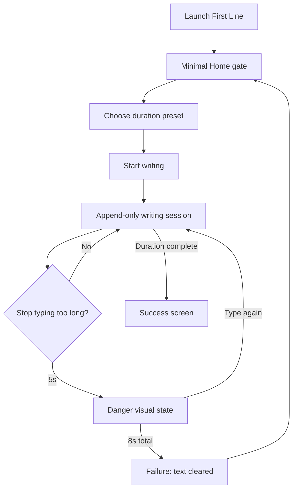

# First Line — Opening Flow Simplification PRD v0

**Status:** Frozen for Slice 1 implementation  
**Scope:** Slice 1 only unless user explicitly approves more  
**Date:** 2026-05-17  
**Target:** Native macOS app only, `apps/macos/FirstLine/`  
**Audience:** OpenCode implementation agent  
**Source decision:** User approved researching iA Writer-like best practices and wants an execution document that prevents ambiguity.

---

## 1. Background

First Line is a native macOS writing app whose core value is not document editing. Its value is coercive first-draft production:

- append-only writing
- no delete / paste / undo
- a danger timer that clears the current draft after inactivity
- fixed writing typography: Pitch Light for Latin text, Zhuque Fangsong for CJK fallback

The current opening flow is too instructional. The app now has a first-run `IntroView` with a 90-second warm-up and a separate returning-user `HomeView`. This creates onboarding ceremony before the user reaches the writing act.

Research direction:

- iA Writer emphasizes immediate writing: "No buttons, no popups, no title bar" and "Just write it."
- iA Writer avoids modal tutorials; documentation lives in guide/support surfaces, not in the first writing moment.
- Ulysses and Bear can justify welcome/library surfaces because they are document organization products.
- Flowstate / Write or Die are closer to First Line: one minimal gate, one consequence sentence, then the canvas.

Product conclusion:

First Line should not use a separate first-run warm-up intro. It should launch into one minimal Home gate every time. The gate must state the destructive mechanic clearly enough to be ethical, then get out of the way.

---

## 2. Goal

Replace the current two-step opening model with a single minimal launch gate.

The implementation must make these true:

1. First launch and returning launch both open to `HomeView`.
2. There is no first-run `IntroView`, no random quote, no 90-second warm-up, and no `hasCompletedIntroduction` gate.
3. Home shows the product promise, the 8-second destructive rule, duration selection, and one primary start action.
4. The writing session behavior remains unchanged: append-only, IME-safe, fixed Pitch Light / Zhuque typography, danger/failure/success state machine.

Success metric:

- A fresh user can launch the app, understand the destructive rule, choose a duration, and start writing from one screen without navigating onboarding.

---

## 3. Non-goals

Do not do any of the following in this slice:

- Do not redesign Session writing UI.
- Do not change caret rendering, fonts, font sizes, line height, or CJK fallback.
- Do not change danger timing: 5 seconds to danger, 8 seconds total to failure.
- Do not add Markdown export.
- Do not add iA Writer-style Markdown Guide documents.
- Do not add Ulysses/Bear-style library onboarding.
- Do not add tooltips, onboarding popovers, coach marks, or multi-step tutorials.
- Do not add new settings.
- Do not change the separate Datastar web app.
- Do not remove Library/Settings surfaces unless compile/test fallout makes a minimal adjustment necessary. This PRD is only about the opening route and Home gate.

---

## 4. Target Users

Primary user:

- A person who wants pressure to produce a rough first draft and tends to over-edit before ideas exist.

Secondary user:

- A writer who already uses another long-term writing or knowledge system and wants First Line only as a raw drafting machine.

Excluded user:

- Someone looking for a complete writing environment, a document manager, or a Markdown editor.

---

## 5. User Scenarios using Given / When / Then

### Scenario 1 — Fresh launch

Given I have no First Line settings file  
When I launch the app  
Then I land on Home, not Intro.

### Scenario 2 — Returning launch

Given I have existing settings from a prior version, with or without `hasCompletedIntroduction`  
When I launch the app  
Then I land on Home.

### Scenario 3 — Understand the destructive mechanic

Given I am on Home  
When I read the opening copy  
Then I can see that stopping for 8 seconds clears the page before I start.

### Scenario 4 — Start a session

Given I am on Home  
When I pick a duration and click Start writing  
Then the app starts a normal append-only writing session using the selected duration.

### Scenario 5 — Fail after stopping

Given I am writing  
When I stop typing for the danger threshold and then continue not typing until 8 seconds total  
Then the app transitions to Failure and clears the current draft as before.

---

## 6. User Flow



There is no Intro branch.

---

## 7. Functional Requirements with Acceptance Criteria

### FR1 — Remove first-run intro route

The app must not route to `IntroView` on fresh launch.

Acceptance criteria:

- `AppState.launchInitialSurface()` always resolves to `.home` on launch.
- There is no conditional routing based on `settings.hasCompletedIntroduction`.
- `startIntroductionTrial()` is removed or made unreachable only if removal creates unnecessary churn. Preferred: remove it.
- `isIntroductionTrialActive` is removed. Preferred: remove it.
- `completeIntroductionIfNeeded()` is removed. Preferred: remove it.

### FR2 — Remove intro surface from product state

The app should not keep an unused Intro product state.

Acceptance criteria:

- `Surface.intro` is removed.
- `RootView.surfaceView(for:)` has no `.intro` case.
- `IntroView.swift` is deleted unless the implementation agent has a strong compile-safety reason to leave it temporarily unused. Preferred: delete it.
- If `IntroView.swift` is deleted, update `apps/macos/FirstLine/CLAUDE.md` member list.

### FR3 — Remove completed-introduction setting

The settings model should not carry a dead onboarding flag.

Acceptance criteria:

- `AppSettings.hasCompletedIntroduction` is removed.
- `AppSettings.defaultValue` no longer includes `hasCompletedIntroduction`.
- Existing settings JSON files that contain `hasCompletedIntroduction` must still decode successfully. Swift `Codable` ignores unknown keys by default; do not add migration code unless tests prove it is needed.
- `SettingsStoreTests.settingsRoundTrip()` is updated to the new `AppSettings` initializer.

### FR4 — Home copy must be exact

Home must use this exact copy unless the user explicitly approves a copy change.

Acceptance criteria:

- Title: `First Line`
- Tagline: `The first draft only moves forward.`
- Rule line: `Stop for 8 seconds and the page clears.`
- Duration label: `Choose a sprint`
- Primary button: `Start writing`
- Footer/rule microcopy: `No delete. No paste. No undo.`

Do not use these rejected copies:

- `Write the first draft. Do not look back.`
- `For 90 seconds, write without editing.`
- `Start 90-second warm-up`
- `After the warm-up, choose your own session length.`

### FR5 — Home layout must stay minimal

Home is a launch gate, not onboarding.

Acceptance criteria:

- Visible controls on Home are only duration selection and Start writing.
- No font controls.
- No warm-up explanation.
- No quote.
- No tutorial paragraphs.
- No Library or Settings buttons on Home.
- Duration options stay exactly: 3, 5, 10, 15, 25 minutes.
- Default selected duration continues to come from `settings.defaultDuration`.

### FR6 — Session behavior must not change

The opening flow change must not affect the editor/session contract.

Acceptance criteria:

- Existing append-only behavior still blocks Backspace, Delete, Cut, Paste, Undo, and Redo outside IME composition.
- Chinese IME composition still works.
- Danger/failure/success state transitions still pass existing tests.
- Fixed fonts remain Pitch Light + Zhuque Fangsong.

### FR7 — Failure copy may be tightened only if touched

The failure screen is not the main scope. If the agent touches it, keep the change minimal and aligned with the new opening copy.

Acceptance criteria if modified:

- Main failure line should be `You stopped. The page cleared.`
- Primary action remains `Try Again` or `Try again`.
- Secondary action remains a way back to Home.
- Do not add recovery, history, or save affordances.

---

## 8. State Model with Transitions

### Product surfaces after implementation

```text
home -> session -> failure -> home
home -> session -> success -> existing success actions
home -> library/settings only through existing non-primary app routes if they remain
```

### Removed states/flags

```text
Surface.intro
AppState.isIntroductionTrialActive
AppSettings.hasCompletedIntroduction
startIntroductionTrial()
completeIntroductionIfNeeded()
```

---

## 9. Error and Edge Cases

- Existing settings JSON has `hasCompletedIntroduction`: app still launches Home; no migration prompt.
- Settings JSON missing: app launches Home.
- Settings JSON invalid: existing fallback behavior remains; app launches Home via `.defaultValue`.
- User has default duration changed in Settings: Home still selects that duration.
- User presses `⌘1`: behavior remains existing `openWritingMode()` behavior unless tests require adjustment.
- App is launched while a prior FirstLine process is running: out of scope.

---

## 10. Data Model Impact

Remove `hasCompletedIntroduction` from `AppSettings`.

No new persisted data.

No manual migration required unless Swift decoding fails in tests. Expected behavior: `Codable` ignores unknown keys in JSON when decoding a struct with fewer properties.

---

## 11. API Contract

No HTTP or external API impact.

Internal contract changes:

- `AppState` should no longer expose intro/warm-up methods or flags.
- Tests should stop constructing `AppSettings(... hasCompletedIntroduction: ...)`.

---

## 12. Frontend Impact

Files likely affected:

- `apps/macos/FirstLine/Sources/FirstLine/App/HomeView.swift`
- `apps/macos/FirstLine/Sources/FirstLine/App/RootView.swift`
- `apps/macos/FirstLine/Sources/FirstLine/App/AppState.swift`
- `apps/macos/FirstLine/Sources/FirstLine/App/IntroView.swift` (preferred delete)
- `apps/macos/FirstLine/Sources/FirstLine/Session/FailureView.swift` (optional copy-only change)

Home should feel like a quiet launch gate:

- centered stack
- warm paper background stays
- existing button style stays unless compile/UI issues force local change
- no new visual system

---

## 13. Backend Impact

No backend.

Infrastructure impact:

- `SettingsStore.swift` model changes only.
- No persistence directory changes.

---

## 14. Security / Abuse / Privacy

- No new network calls.
- No telemetry.
- No file-system expansion.
- Removing onboarding state slightly reduces persisted user data.

---

## 15. Implementation Slices

### Slice 1 — Remove intro and simplify Home

Objective:

- Make all launches land on one minimal Home gate with exact copy and unchanged writing mechanics.

Non-goals:

- No session editor changes.
- No success flow redesign.
- No export/library/settings redesign.

Files to inspect:

- `apps/macos/FirstLine/Sources/FirstLine/App/AppState.swift`
- `apps/macos/FirstLine/Sources/FirstLine/App/RootView.swift`
- `apps/macos/FirstLine/Sources/FirstLine/App/HomeView.swift`
- `apps/macos/FirstLine/Sources/FirstLine/App/IntroView.swift`
- `apps/macos/FirstLine/Sources/FirstLine/Infrastructure/SettingsStore.swift`
- `apps/macos/FirstLine/Tests/FirstLineTests/SmokeFlowTests.swift`
- `apps/macos/FirstLine/Tests/FirstLineTests/SettingsStoreTests.swift`
- `apps/macos/FirstLine/docs/MANUAL_QA.md`
- `apps/macos/FirstLine/CLAUDE.md`

Files likely to modify:

- Same list as above, plus optional `FailureView.swift` if copy is tightened.

Validation commands:

```bash
cd apps/macos/FirstLine
swift build
swift test
swift run
```

Acceptance test:

- Clean config launch shows Home, not Intro.
- Returning launch shows Home.
- Home exact copy appears.
- Starting a session still reaches editor.

Risks:

- Tests currently assert `.intro` for fresh launch and must be updated rather than deleted.
- Removing `hasCompletedIntroduction` touches settings model and tests.
- Deleting `IntroView.swift` requires updating `RootView` and `CLAUDE.md`.

Stop conditions:

- Stop if removing intro causes session start or navigation tests to need a broader redesign.
- Stop if settings decoding of old JSON fails and requires a migration decision.
- Stop if manual app launch cannot verify Home visually.

---

## 16. Test Plan

Automated:

- Update `SmokeFlowTests.firstLaunchShowsWarmUpIntroAndReturningLaunchShowsHome` to something like `launchAlwaysShowsHome`.
- Update every `AppSettings(...)` initializer to remove `hasCompletedIntroduction`.
- Add or update an assertion that fresh `AppState` starts at `.home`.
- Keep session/danger/editor tests passing unchanged.

Manual QA:

1. Temporarily remove `~/Library/Application Support/First Line/Config/settings.json` or use a temp HOME/config path.
2. Run `swift run` from `apps/macos/FirstLine`.
3. Confirm Home appears directly.
4. Confirm Home has exact copy from FR4.
5. Confirm there is no warm-up, quote, or intro.
6. Start writing and type English.
7. Start writing and type Chinese with IME.
8. Stop typing until failure; confirm failure still clears text.

---

## 17. Open Questions

None blocking Slice 1.

Non-blocking future question:

- Should failure copy become `You stopped. The page cleared.` in the same slice, or stay as current `Text cleared. Try again?` until a broader copy pass?

---

## 18. Parking Lot

- iA Writer-style editable guide document: rejected for now because First Line is not a Markdown/document app.
- Ghost placeholder inside editor: possible later, but not needed for opening simplification.
- First-run sample session: rejected for now; it adds ceremony.
- Stronger failure teaching moment: useful later if user testing shows the danger mechanic is missed.
- Release page screenshots and README polish.

---

## 19. Review Log

- 2026-05-17: Drafted from user request plus research into iA Writer, Ulysses, Bear, Flowstate/Write or Die patterns.
- 2026-05-17: Decision: implement the Flowstate-style minimal gate, not iA Writer's zero-copy blank document, because First Line destroys text and must disclose the destructive rule before writing.
