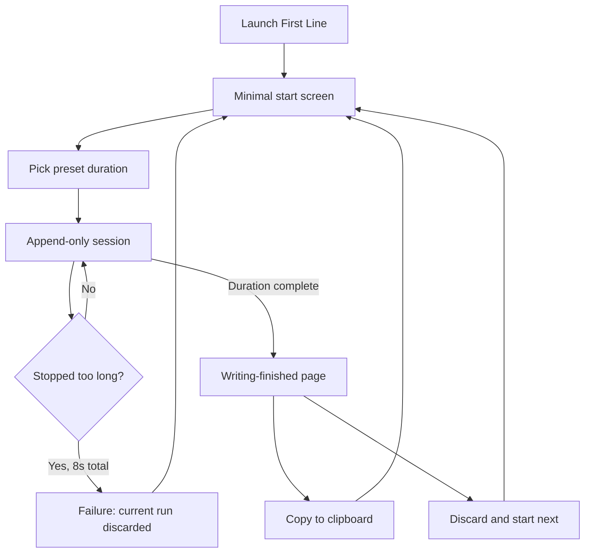

# First Line — No-Sidebar Brain Dump Flow PRD v0

**Status:** Draft v0  
**Date:** 2026-04-25  
**Target:** Native macOS app only  
**Audience:** Founder + OpenCode implementation agents  
**Related app:** `apps/macos/FirstLine/`

---

## 1. Background

First Line currently has the right core writing mechanic but the wrong product frame. The append-only editor, danger timer, and focused session surface support forced brain-dump writing. The surrounding shell still behaves like a document app: sidebar navigation, Home/Library/Settings surfaces, automatic file persistence, Finder reveal, and default-editor handoff.

The new direction is stricter: First Line is not an editor and not a document manager. It is a coercive first-pass machine that forces raw thoughts into existence, then pushes the user to save that raw material somewhere they own, such as Obsidian or iCloud Drive.

Confirmed product decisions:

| Decision | Options considered | Final choice | Reason | Product impact | Engineering impact | Open risk |
|---|---|---|---|---|---|---|
| Successful-session output model | Clipboard-first, auto-save, copy-only | Clipboard-first, save optional | Avoids turning the app into a document library | Writing ends on a clear “copy or throw away” moment, not a filing system | Stop unconditional save-on-success | User may discard valuable text |
| Save destination | Internal stash, clipboard only, Obsidian-specific, generic export | Export Markdown to user-selected location | External handoff preserves user ownership | Supports Obsidian/iCloud without app-level management | Use macOS save/export panel or equivalent | Export UX must not feel like document editing |
| Continue writing | Editable draft, invisible carryover, separate sessions, locked prefix | Locked prefix | Keeps context without allowing editing | User can build on previous output while staying append-only | Editor needs read-only prefix + append-only suffix semantics | Prefix/suffix boundary bugs could break trust |
| Save warning | None, banner, one-time onboarding, must-choose reminder page | Must-choose reminder page | Matches API-key “copy now, you may not see it again” mental model | Teaches users to collect useful writing material | Success screen must require Copy or Discard in Slice 1 | Could feel too stern if wording is heavy-handed |
| Navigation shell | Sidebar, hub, command palette, start screen | No sidebar; minimal start screen | Sidebar creates document-app posture | Opens into writing intent, not management | Replace `NavigationSplitView` shell | Settings/library removal affects tests |
| Duration selection | Separate presets, custom minutes, fixed default, shared presets | Same presets for initial and continue | Consistent and low-friction | User chooses sprint length once per run | Reuse existing duration options | Preset list may need later tuning |

---

## 2. Goal

Make First Line feel like a native, iA Writer-taste brain-dump machine:

1. Open the app and start a timed writing sprint with minimal friction.
2. Force forward-only writing with the existing danger mechanic.
3. On success, show the output as a one-time resource that must be copied or explicitly discarded in Slice 1.
4. Let users continue from prior output as locked context, never as editable document text.
5. Encourage users to collect raw material in their own system, especially Obsidian or iCloud Drive, without building an internal document manager.

Success metrics for Slice 1:

- Returning user can launch app and reach writing mode in <= 1 action.
- No persistent sidebar or document-management surface is visible in the primary flow.
- After success, user cannot accidentally leave the output without Copy or explicit Discard in Slice 1.
- Existing append-only and danger-timer tests still pass or are updated to equivalent behavior.

---

## 3. Non-goals

- No internal Library surface for Slice 1.
- No file browser, folders, tags, search, or document-management UI.
- No automatic save of every successful session.
- No “Open in Default Editor” action in the primary success flow.
- No “Reveal in Finder” action in the primary success flow.
- No rich text, markdown preview, formatting toolbar, or editing mode.
- No AI summary, API keys, cloud sync, accounts, collaboration, telemetry, streaks, or gamification.
- No changes to the separate Datastar web implementation unless explicitly requested later.

---

## 4. Target Users

### Primary user

A person who wants to write but stalls because the first sentence or first paragraph feels too exposed, messy, or high-stakes.

They need pressure, not another editor.

### Secondary user

A writer, diarist, founder, or thinker who already has a real knowledge system such as Obsidian, iCloud Drive, Apple Notes, or a folder of Markdown files, and wants First Line only as a raw-material generator.

### Excluded user

Someone looking for a complete writing environment, a Markdown editor, a document library, or a notes app replacement.

---

## 5. User Scenarios using Given / When / Then

### Scenario 1: Start a brain dump

Given I open First Line  
When I see the minimal start screen  
Then I can choose a preset duration and start writing without seeing a sidebar, library, or settings hub.

### Scenario 2: Keep moving during a session

Given I am in an active writing session  
When I stop typing for the danger threshold  
Then the existing danger visual feedback appears and I understand I must continue typing or lose the current session.

### Scenario 3: Succeed and copy the output

Given I complete the timed session  
When the writing-finished page appears  
Then I can copy the full output to the clipboard, and the app treats the text as handled.

### Scenario 4: Succeed and throw the text away

Given I complete a session and do not want to keep it  
When I choose Discard and start next  
Then the app makes it clear that this text will be lost, then returns me to the start screen.

### Scenario 5: Later, export Markdown

Given I complete the timed session  
When I choose Export Markdown  
Then I can save a Markdown file to a user-selected location such as iCloud Drive or an Obsidian vault, and First Line does not keep managing that file afterward.

### Scenario 6: Later, continue from existing output

Given I complete a session and choose Continue  
When I select a new preset duration  
Then the prior output appears as locked context and the new session only appends text after it.

---

## 6. User Flow using Mermaid or ASCII



Later slices add Export Markdown and Continue. Slice 1 intentionally does not include those paths.

---

## 7. Functional Requirements with acceptance criteria

### FR1 — Remove persistent sidebar

The app must not show a persistent sidebar in the primary flow.

Acceptance criteria:

- `RootView` or equivalent top-level shell does not render a `NavigationSplitView` sidebar for Home/Session/Success/Failure/Library/Settings.
- Active writing, success, failure, and start screens are single-surface views.
- Keyboard shortcuts must not expose a sidebar toggle.

### FR2 — Minimal start screen

The app must replace the current hub with a minimal start surface.

Acceptance criteria:

- Start screen shows product framing, preset duration selection, and Start action.
- Start screen does not show Library, Settings, Open Folder, or document-management actions.
- Returning users can start a session from launch with one primary action.

### FR3 — Preserve append-only danger session

The writing session must keep the existing core mechanic.

Acceptance criteria:

- Backspace/delete/cut/paste/undo/redo remain blocked during active writing.
- IME composition remains supported.
- Stop typing for 5 seconds enters danger state.
- Stop typing for 8 seconds total fails and clears the current unhandled session text.
- Duration completion transitions to the writing-finished page.

### FR4 — Writing-finished page requires a choice

The success screen must behave like a clear “copy it or throw it away” reminder page.

Acceptance criteria:

- Success copy explains in plain language: this text may not be shown again after leaving unless copied.
- In Slice 1, the only primary actions are Copy full text and Discard and start next.
- User cannot start the next session from the success screen without either copying the text or explicitly choosing Discard.
- Discard action is visually secondary/destructive and uses clear wording.

### FR5 — Copy to clipboard

The writing-finished page must provide a primary Copy action.

Acceptance criteria:

- Copy places the full current output, including any locked prefix and new suffix, on the macOS clipboard as plain text.
- Successful copy marks the text as handled and allows the user to start the next session.
- Copy failure keeps the user on the writing-finished page and shows an error.

### FR6 — Discard and start next

The writing-finished page must provide a clear way to throw away the text and begin again.

Acceptance criteria:

- Discard copy makes the consequence clear: the text will not be saved by First Line.
- Discard returns to the minimal start screen or starts the next flow according to the current route design.
- Discard does not write a Markdown file or internal library item.

### FR7 — Later: Export Markdown

The writing-finished page should later provide Export Markdown to a user-selected location.

Acceptance criteria:

- Export opens a native save/export flow.
- Default file extension is `.md`.
- Default filename is deterministic and human-readable, based on completion timestamp and/or first line.
- Exported file includes the raw text and minimal metadata if useful; it must remain readable Markdown.
- Successful export marks the text as handled.
- First Line does not add the exported file to an internal library or continue managing it.

### FR8 — Later: Continue with locked prefix

The writing-finished page should later provide Continue.

Acceptance criteria:

- Continue asks for the next session duration using the same preset options as initial start.
- Prior output appears as locked read-only prefix/context.
- New typing can only append after the locked prefix.
- User cannot move the caret into the locked prefix or modify it.
- Final success output includes both locked prefix and newly appended text.

### FR9 — Failure remains lossful

Failure must not become recovery or draft management.

Acceptance criteria:

- Normal danger failure discards current session suffix.
- Failure screen offers Try Again / Start Over style action only.
- Failure screen does not expose library, open file, or reveal file affordances.

### FR10 — Remove primary document-manager affordances

The primary flow must not expose file-management actions that make First Line feel like a document app.

Acceptance criteria:

- Writing-finished page does not show Open in Default Editor.
- Writing-finished page does not show Reveal in Finder.
- Primary navigation does not include Library or Settings surfaces.
- Existing internal persistence code may remain only if unused by the primary flow or explicitly repurposed for export.

---

## 8. State Model with transitions

### Product states

```text
start
  -> writing
  -> danger
  -> failure
  -> writing_finished
```

Later slices add `export_markdown`, `continue_duration`, and `writing_with_locked_prefix`.

### Transitions

| From | Event | To | Notes |
|---|---|---|---|
| start | Start with preset duration | writing | Empty prefix |
| writing | No input for 5s | danger | Visual pressure only |
| danger | Input resumes | writing | Danger clears |
| danger | No input reaches 8s total | failure | Current suffix lost |
| writing/danger | Duration completes | writing_finished | Full output visible |
| writing_finished | Copy succeeds | start | Output handled |
| writing_finished | Discard confirmed | start | Output intentionally lost |

### Data invariants

- `lockedPrefix` is immutable once a continuation session starts.
- `editableSuffix` is append-only during a live session.
- `fullOutput = lockedPrefix + editableSuffix` for copy/export/success display.
- For Slice 1, `lockedPrefix` is not implemented yet; successful output is a single text string.
- Normal danger failure discards the current session text.
- Continuation failure behavior must be decided before implementing Continue.

---

## 9. Error and Edge Cases

### Clipboard failure

- Show an inline error.
- Keep the user on the writing-finished page.
- Do not mark output as handled.

### Export cancelled

- Return to the writing-finished page.
- Keep output visible.
- Do not mark output as handled.

### Export write failure

- Show file write error in plain language.
- Keep the user on the writing-finished page.
- Offer Copy as fallback.

### App close while writing-finished page is unhandled

- Slice 1 does not intercept closing the whole macOS window.
- Slice 1 must still prevent ordinary in-app “start next” navigation unless the user copies or discards.

### Continue from a long prefix

- Preserve typewriter positioning for the append point.
- Older prefix text may fade visually, but must remain readable enough on success/export.

### IME composition at prefix boundary

- IME must not be broken by locked-prefix enforcement.
- Composition text must only apply to the editable suffix.

### Reduced motion

- Existing reduced-motion behavior must still reduce or remove pulse/blur animations where applicable.

---

## 10. Data Model Impact

### New or changed runtime concepts

```swift
// Conceptual shape only, not implementation code.
SessionDraft
- lockedPrefix: String
- editableSuffix: String
- duration: TimeInterval
- phase: idle | writing | danger | failure | success
- outputHandled: Bool
```

### Persistence changes

- Stop treating every successful session as automatically persisted app data.
- Slice 1 does not add a new persisted data model for completed sessions.
- Exported Markdown is user-owned output, not an internal database/library record.
- Existing Markdown persistence service may be reused as an export writer only if it does not automatically load/manage a library.
- Settings persistence may remain for theme/reduced motion/default duration if those settings remain accessible through native app menus or future lightweight preferences.

### Markdown export content

Minimum acceptable export:

```markdown
---
created_at: <ISO8601>
duration_seconds: <number>
word_count: <number>
app: First Line
---

<raw output>
```

Markdown export is not part of Slice 1. Before the export slice starts, decide whether exported files use YAML front matter or raw text only.

---

## 11. API Contract

No network API is required.

### Local OS integrations

| Integration | Purpose | Required behavior |
|---|---|---|
| macOS pasteboard | Copy output | Write plain text only |
| Native save/export panel | Later Markdown export | User chooses destination; app writes `.md` file |
| File system write | Later Markdown export | Write only to user-selected URL |

### Explicitly excluded

- No server API.
- No AI provider API.
- No Obsidian API dependency.
- No iCloud API dependency.
- No automatic sync integration.

---

## 12. Frontend Impact

Affected SwiftUI/AppKit surfaces:

- `Sources/FirstLine/App/RootView.swift`
- `Sources/FirstLine/App/AppState.swift`
- `Sources/FirstLine/App/HomeView.swift` or replacement start view
- `Sources/FirstLine/Session/SessionView.swift`
- `Sources/FirstLine/Session/SuccessView.swift`
- `Sources/FirstLine/Session/FailureView.swift`
- `Sources/FirstLine/Editor/AppendOnlyTextView.swift`
- `Sources/FirstLine/Editor/EditorViewRepresentable.swift`
- `Sources/FirstLine/Settings/SettingsView.swift` if settings entry changes
- `Sources/FirstLine/Library/LibraryView.swift` if removed from primary build path

Expected UI changes:

- Replace sidebar shell with single-surface routing.
- Replace hub-like Home with minimal start screen.
- Replace success actions with Copy full text / Discard and start next for Slice 1.
- Add locked-prefix visual treatment in a later Continue slice.
- Remove visible Library/Settings navigation from primary flow.

---

## 13. Backend Impact

There is no backend service.

Local application-service impact:

- `PersistenceService` should stop being part of automatic success handling for this flow.
- A small export service may be introduced or `PersistenceService` may be narrowed to explicit Markdown export.
- `AppPaths.libraryDirectory` must not be exposed as a primary product concept in this flow.
- Tests that assume auto-save/library behavior need replacement with writing-finished/export tests.

---

## 14. Security / Abuse / Privacy

- User writing must remain local unless the user manually exports to a chosen location.
- No telemetry or analytics should be introduced.
- Copy writes sensitive text to the system clipboard; success copy should not hide this fact.
- Later export may place sensitive text in iCloud Drive or Obsidian sync folders; wording should say “Save this somewhere you trust.”
- The writing-finished page must not trap users if copy fails; Discard remains available as an explicit escape.
- Normal danger failure is intentionally destructive. This must be explained before writing starts.

---

## 15. Implementation Slices

### Slice 1 — Remove sidebar and clean up the first writing loop

Objective:
- Replace sidebar/hub navigation with a single-surface start → session → writing-finished/failure flow.
- Stop automatically saving successful sessions.
- Make the writing-finished page simple: Copy full text or Discard and start next.

Non-goals:
- No locked-prefix continue.
- No Markdown export implementation.
- No Obsidian or iCloud Drive export.
- No app-window close interception.
- No settings redesign beyond removing primary sidebar entry.

Files to inspect:
- `apps/macos/FirstLine/Sources/FirstLine/App/RootView.swift`
- `apps/macos/FirstLine/Sources/FirstLine/App/AppState.swift`
- `apps/macos/FirstLine/Sources/FirstLine/App/HomeView.swift`
- `apps/macos/FirstLine/Sources/FirstLine/FirstLineApp.swift`
- `apps/macos/FirstLine/Sources/FirstLine/Session/SuccessView.swift`
- `apps/macos/FirstLine/Sources/FirstLine/Infrastructure/PersistenceService.swift`
- `apps/macos/FirstLine/Tests/FirstLineTests/SmokeFlowTests.swift`

Files likely to modify:
- `RootView.swift`
- `AppState.swift`
- `HomeView.swift` or new start view file
- `SuccessView.swift`
- `FirstLineApp.swift`
- `SmokeFlowTests.swift`
- `apps/macos/FirstLine/CLAUDE.md` if file list/responsibilities change

Validation commands:
- `swift build` from `apps/macos/FirstLine`
- `swift test` from `apps/macos/FirstLine`

Acceptance test:
- Launch state renders no sidebar and exposes only minimal start actions.
- Start session still reaches writing mode.
- Success/failure routing works without `NavigationSplitViewVisibility`.
- A successful session is not automatically saved to the internal library.
- The writing-finished page shows Copy full text and Discard/start-next actions only.
- The writing-finished page does not show Open in Default Editor, Reveal in Finder, Go to Library, Export Markdown, or Continue.

Risks:
- Existing tests encode sidebar visibility.
- Removing navigation shortcuts may leave dead commands.
- Existing success flow assumes `lastSavedFileURL` and automatic persistence.

Stop conditions:
- Stop if append-only typing or danger timer breaks.
- Stop if app cannot route back from success/failure to start.
- Stop if successful sessions are still automatically written to the internal library.

### Slice 2 — Export Markdown handoff

Objective:
- Add explicit Markdown export to user-selected destination.

Non-goals:
- No continue flow.
- No internal library.
- No Obsidian-specific integration.
- No iCloud-specific integration.

Files to inspect:
- `SuccessView.swift`
- `AppState.swift`
- `PersistenceService.swift`
- `PersistenceOnlyTests.swift`

Files likely to modify:
- `PersistenceService.swift` or new export service
- `SuccessView.swift`
- `AppState.swift`
- persistence/export tests

Validation commands:
- `swift build`
- `swift test`

Acceptance test:
- Export writes `.md` content to a selected URL in tests via injectable file destination/service.
- Export success marks the text as handled.
- Export cancel/failure does not mark the text as handled.

Risks:
- Native save panel needs test seam to avoid UI automation in unit tests.

Stop conditions:
- Stop if implementation starts managing exported files as a library.

### Slice 3 — Continue with locked prefix

Objective:
- Let users continue from successful output while keeping old text read-only and new text append-only.

Non-goals:
- No editable draft mode.
- No session list/history.

Files to inspect:
- `SessionEngine.swift`
- `AppendOnlyTextView.swift`
- `EditorViewRepresentable.swift`
- `SessionView.swift`
- `AppState.swift`
- `SuccessView.swift`
- `SessionEngineTests.swift`

Files likely to modify:
- `SessionEngine.swift`
- `AppendOnlyTextView.swift`
- `EditorViewRepresentable.swift`
- `SessionView.swift`
- `AppState.swift`
- `SuccessView.swift`
- tests for prefix boundary behavior

Validation commands:
- `swift build`
- `swift test`
- Manual IME QA per `apps/macos/FirstLine/docs/MANUAL_QA.md`

Acceptance test:
- Continue prompts for same preset durations.
- Locked prefix cannot be edited, deleted, selected for replacement, or cut.
- New suffix appends after prefix.
- Final copy/export includes prefix + suffix.

Risks:
- Prefix locking can easily break IME or caret behavior.
- This is the highest-risk slice and should not be merged without manual typing QA.

Stop conditions:
- Stop if IME composition breaks.
- Stop if caret can enter or mutate locked prefix.

---

## 16. Test Plan

### Automated tests

- Update smoke tests to assert no sidebar-based route is required.
- Keep or update session engine tests for idle → danger → failure and duration → success.
- Add writing-finished page tests for copied/discarded output state.
- Add copy action test using pasteboard abstraction if available.
- Add export writer tests with temporary directory and deterministic filename.
- Add locked-prefix tests before implementing Continue.

### Manual QA

- Launch app and verify no sidebar appears in primary flow.
- Start a 3-minute or shortest available session.
- Verify Backspace/Delete/Cut/Paste/Undo/Redo remain blocked.
- Verify danger visual appears after idle threshold.
- Complete session and confirm the “copy it or throw it away” wording is clear.
- Try starting another session before copying or discarding; verify explicit discard is required.
- Copy output and paste into a plain text target.
- Export Markdown to an iCloud Drive folder and an Obsidian vault folder.
- Continue from success and verify previous text is visible but locked.
- Test Chinese IME during normal session and after locked prefix.

---

## 17. Open Questions

Blocking for Slice 1:

- None.

Non-blocking before later slices:

- Should exported Markdown include YAML front matter in the export slice, or raw text only?
- What exact preset durations should remain: current implementation list or revised list?
- Should app-window close be intercepted while the writing-finished page is unhandled?
- After a continuation session fails, should the locked prefix return to the previous writing-finished page or should the whole continuation attempt be considered discarded?
- Where should lightweight preferences live after Settings is removed from primary navigation: app menu only, future command palette, or omitted for MVP?

---

## 18. Parking Lot

- Obsidian-specific helper that remembers a vault/folder.
- iCloud Drive default export location suggestion.
- Command palette for advanced actions.
- One-time onboarding explaining the API-key-style resource warning.
- Favorite/star metadata inside exported Markdown.
- “Copy as diary prompt” or “Copy as writing-material prompt.”
- Menu-bar quick dump window.

---

## 19. Review Log

| Date | Reviewer | Notes |
|---|---|---|
| 2026-04-25 | Hephaestus | Drafted v0 from `/prd` discovery and confirmed decisions. Not reviewed/frozen. |
| 2026-04-25 | Hephaestus | Updated after review: Slice 1 narrowed to no sidebar, minimal start, no auto-save, and Copy/Discard writing-finished page only. |
